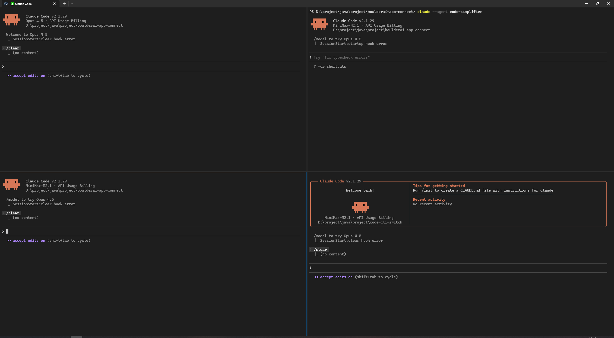

# cs-cli

Claude Settings CLI - 一个用于管理 Claude Code 配置文件的命令行工具。

## 为什么需要这个工具？

在同一个 Windows 窗口中，通过多开 PowerShell 实现 Claude Code 的多账号/多配置同时运行，每个 PowerShell 窗口使用不同的配置。



通过 cs-cli 可以在不同配置之间快速切换，配合多窗口实现多账号并行工作。

## 功能特性

- **快速切换**: 在多个配置变体之间快速切换
- **交互式选择**: 直接运行 `cs-cli` 使用上下键选择并切换
- **TUI 界面**: 全功能交互式终端界面
- **配置比较**: 比较不同配置之间的差异
- **备份恢复**: 自动备份和手动恢复功能
- **跨平台**: 支持 Windows、macOS、Linux

## 安装

```bash
# 安装依赖
npm install

# 全局链接本地包
npm install -g .
```

或使用 npx（无需安装）：

```bash
npx cs-cli
```

## 快速开始

### 方式一：交互式选择（推荐）

直接运行 `cs-cli`，使用上下键选择配置：

```bash
cs-cli
```

```
Select configuration to switch:
Use ↑/↓ to select, Enter to confirm, q to quit

  openai (active)
▸ local
```

### 方式二：命令行直接切换

```bash
cs-cli switch openai
```

## 配置规范

在 Claude 配置目录（默认 `~/.claude` 或 `C:\Users\<用户>\.claude`）中创建命名配置文件：

```
.claude/
├── settings.json              # 当前生效的配置
├── settings.json.default      # 默认配置
├── settings.json.openai       # OpenAI 配置
├── settings.json.anthropic    # Anthropic 配置
└── settings.json.local        # 本地模型配置
```

## 命令使用

### 查看帮助

```bash
cs-cli --help          # 查看主帮助
cs-cli <command> -h    # 查看子命令帮助
```

### 交互式选择（默认）

```bash
cs-cli
```

使用上下键选择，Enter 确认，q 退出。

### 列出所有配置

```bash
cs-cli list
cs-cli ls              # 简短别名
```

### 切换配置

```bash
# 切换到 openai 配置
cs-cli switch openai
cs-cli sw openai       # 简短别名

# 预览切换（不实际执行）
cs-cli switch openai --dry-run

# 切换时不创建备份
cs-cli switch openai --no-backup
```

### 查看当前配置

```bash
cs-cli current
```

### 比较配置

```bash
# 比较当前配置与 openai 配置
cs-cli diff openai

# 比较两个配置
cs-cli diff openai anthropic
```

### 备份与恢复

```bash
# 创建备份
cs-cli backup

# 创建备份并列出所有备份
cs-cli backup --list

# 恢复最新备份
cs-cli restore

# 恢复指定备份
cs-cli restore 20260204T102300
```

### 交互式 TUI

```bash
cs-cli interactive
cs-cli ui              # 简短别名
cs-cli tui             # 另一个别名
```

#### TUI 快捷键

| 按键 | 操作 |
|------|------|
| ↑/↓ 或 j/k | 选择配置 |
| Enter | 确认切换 |
| d | 切换差异视图 |
| r | 刷新列表 |
| b | 创建备份 |
| q / Esc | 退出 |

## 配置路径

工具按以下优先级查找配置目录：

1. 命令行参数 `--config-dir` 或 `-c`
2. 环境变量 `CLAUDE_CONFIG_DIR`
3. 默认路径：
   - Windows: `%USERPROFILE%\.claude`
   - macOS/Linux: `~/.claude`

### 指定配置目录

```bash
# 使用命令行参数
cs-cli -c /custom/path list

# 使用环境变量
export CLAUDE_CONFIG_DIR=/custom/path
cs-cli list
```

## 开发

```bash
# 克隆项目
git clone <repo-url>
cd cs-cli

# 安装依赖
npm install

# 本地测试
npm link
cs-cli list

# 运行测试
npm test
```

## 许可证

MIT
