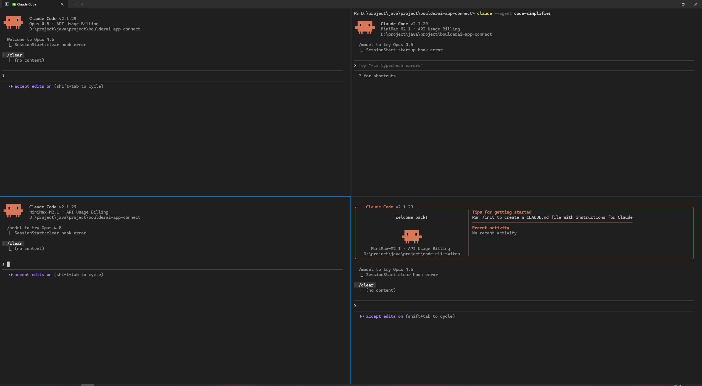

# cs-cli

多编码工具 CLI 配置切换工具 - 用于快速切换不同编码工具的配置文件。



## 功能特性

- **多工具支持** - Claude (JSON)、Gemini (ENV)、Codex (TOML)
- **快速切换** - 在多个配置变体之间一键切换
- **交互式选择** - 无参数运行时的简洁选择界面
- **配置比较** - 比较不同配置之间的差异
- **备份恢复** - 自动备份和手动恢复功能
- **审计日志** - 记录所有配置操作历史
- **Shell 补全** - 支持 Bash、Zsh、PowerShell、Fish
- **跨平台** - 支持 Windows、macOS、Linux
- **国际化** - 支持中文/英文界面（默认中文）

## 安装

```bash
# 安装依赖并全局链接
npm install
npm install -g .
```

或使用 npx（无需安装）：

```bash
npx cs-cli
```

## 快速开始

### 交互式模式

直接运行 `cs-cli`，先选择编码工具，再选择配置：

```bash
cs-cli
```

```
选择编码工具:
  claude  - Claude
  gemini  - Gemini
  codex   - Codex

Gemini 配置变体:
  prod
  dev
  test
```

### 命令行模式

```bash
# 切换 Claude 配置（默认）
cs-cli switch openai

# 切换 Gemini 配置
cs-cli switch prod -s gemini

# 切换 Codex 配置
cs-cli switch local -s codex
```

## 支持的编码工具

### Claude (JSON 格式)

```
~/.claude/
├── settings.json           # 当前生效的配置
├── settings.json.default   # 默认配置
├── settings.json.openai    # OpenAI 配置
└── settings.json.local     # 本地模型配置
```

### Gemini (ENV 格式)

```
~/.gemini/
├── .env          # 当前生效的配置
├── .env.prod     # 生产环境配置
├── .env.dev      # 开发环境配置
└── .env.test     # 测试环境配置
```

### Codex (TOML 格式)

```
~/.codex/
├── config.toml           # 当前生效的配置
├── config.toml.default   # 默认配置
├── config.toml.local     # 本地配置
└── config.toml.remote    # 远程配置
```

## 命令参考

### 查看配置

```bash
# 查看帮助
cs-cli --help
cs-cli <command> -h

# 列出所有编码工具的配置概览
cs-cli list
cs-cli ls              # 简短别名

# 列出指定编码工具的配置
cs-cli list -s claude
cs-cli list -s gemini

# 查看当前生效的配置
cs-cli current
cs-cli current -s claude
cs-cli current --all   # 所有工具详细配置
```

### 切换配置

```bash
# 切换配置
cs-cli switch openai
cs-cli sw openai       # 简短别名

# 指定编码工具
cs-cli switch prod -s gemini
cs-cli switch local -s codex

# 预览切换（不实际执行）
cs-cli switch openai --dry-run

# 切换时不创建备份
cs-cli switch openai --no-backup

# 撤销最后一次切换
cs-cli undo
cs-cli undo -s gemini
```

### 比较配置

```bash
# 比较当前配置与指定配置
cs-cli diff openai

# 比较两个配置
cs-cli diff openai anthropic

# 比较其他编码工具
cs-cli diff prod -s gemini
```

### 备份与恢复

```bash
# 创建备份
cs-cli backup
cs-cli backup -s gemini
cs-cli backup --list   # 列出所有备份

# 恢复备份
cs-cli restore                    # 恢复最新
cs-cli restore 20260204102300     # 恢复指定备份
cs-cli restore -s gemini
```

### 系统工具

```bash
# 初始化配置目录
cs-cli init claude
cs-cli init gemini

# 安装 ConfigChange hook
cs-cli install-hook

# 生成 Shell 补全脚本
cs-cli completion bash
cs-cli completion bash --install
cs-cli completion zsh

# 查看审计日志
cs-cli audit
cs-cli audit -s claude
cs-cli audit -n 50
```

## StatusLine 状态栏

cs-cli 支持在 Claude Code 状态栏显示当前使用的厂商名称和上下文使用情况。

### 自动启用

使用 `cs-cli switch` 切换配置时，会自动在 `settings.json` 中注入 `statusLine` 配置。

### 效果

状态栏显示格式：`厂商:GLM | 上下文:35% ▓▓▓░░░░░░ | 📁project-name`

| 厂商 | 颜色 | 示例 |
|------|------|------|
| GLM | 亮绿色 | 厂商:GLM |
| KIMI | 青色 | 厂商:KIMI |
| MINIMAX | 金色 | 厂商:MINIMAX |
| DeepSeek | 蓝色 | 厂商:DEEPSEEK |
| Qwen | 橙色 | 厂商:QWEN |
| DuckCoding | 紫色 | 厂商:DUCKCODING |
| Claude | 粉紫色 | 厂商:CLAUDE |
| OpenAI | 绿色 | 厂商:OPENAI |
| Gemini | 天蓝色 | 厂商:GEMINI |

### 上下文进度条

进度条颜色随使用率变化：
- **绿色** (<50%) - 安全区间
- **黄色** (50-79%) - 注意区间
- **红色** (≥80%) - 警示区间

## 配置

### 语言设置

```bash
# 中文（默认）
export CS_CLI_LANG=zh

# 英文
export CS_CLI_LANG=en
```

### 配置路径

配置目录按以下规则查找：

| 系统 | 路径 |
|------|------|
| Windows | `%USERPROFILE%\.claude` / `%USERPROFILE%\.gemini` / `%USERPROFILE%\.codex` |
| macOS/Linux | `~/.claude` / `~/.gemini` / `~/.codex` |

## 开发

```bash
# 克隆项目
git clone <repo-url>
cd cs-cli

# 安装依赖
npm install

# 本地测试
npm link
cs-cli list

# 运行测试
npm test
```

## 许可证

MIT
